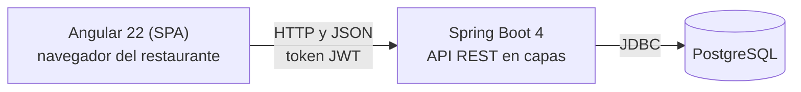

# Smart RDP

Sistema web de gestión de bodega para el restaurante **Doña Paula** (Viña Santa Rita, Buin). Reemplaza el registro manual en papel y planillas Excel por un sistema que controla productos, lotes, entradas, salidas y solicitudes de insumos con trazabilidad por usuario.

> Proyecto de Título **PTY4614-002D · Equipo 3** · Duoc UC, Sede San Bernardo · Docente: Mallén González González

## Contenido

1. [Descripción](#descripción)
2. [Funcionalidades](#funcionalidades)
3. [Tecnologías](#tecnologías)
4. [Arquitectura](#arquitectura)
5. [Estructura del repositorio](#estructura-del-repositorio)
6. [Ejecución local](#ejecución-local)
7. [Pruebas](#pruebas)
8. [Roles y accesos](#roles-y-accesos)
9. [Metodología](#metodología)
10. [Integrantes y roles](#integrantes-y-roles)
11. [Documentación](#documentación)
12. [Estado del proyecto](#estado-del-proyecto)

## Descripción

La bodega del restaurante se gestiona con notas en papel y planillas Excel. Eso provoca pérdida de trazabilidad de los insumos, mermas de entre 60.000 y 80.000 pesos al mes y 17 a 18 horas mensuales de conteos manuales para reportar al sistema SAP.

**Dirigido a:** el personal del restaurante: el administrador (gestiona usuarios y revisa la analítica), el encargado de bodega (registra entradas y salidas y aprueba solicitudes) y los empleados que piden o devuelven insumos (ver [Roles y accesos](#roles-y-accesos)).

Smart RDP digitaliza ese flujo:

- Registra productos, lotes con fecha de vencimiento y cada movimiento de stock.
- Aplica **FEFO** (primero en vencer, primero en salir) en las salidas.
- Permite que el personal pida insumos y los devuelva, y que el bodeguero apruebe cada solicitud.
- Entrega reportes de consumo y de vencimientos para sustentar el reporte a SAP.

**Fuera de alcance:** integración directa con SAP, módulos de venta (POS) y modelos de IA.

## Funcionalidades

| Módulo | Qué permite |
|---|---|
| **Productos** | Alta, edición, deshabilitación y reactivación (borrado lógico); código PTV (vinos y licores) o código numérico según la categoría; importación desde Excel con validación previa; exportación a Excel y PDF. |
| **Catálogos** | Categorías (con la marca «Requiere código PTV») y unidades de medida. |
| **Movimientos** | Entradas con lote y vencimiento (también por importación desde Excel), salidas por FEFO, historial con filtros y calendario mensual. |
| **Stock y alertas** | Estado de stock (normal, bajo, crítico, agotado) y alertas de productos próximos a vencer. |
| **Solicitudes** | El empleado crea pedidos y devoluciones; el bodeguero los aprueba o rechaza ajustando la cantidad realmente entregada. Cada aprobación genera el movimiento correspondiente. |
| **Analítica** | Consumo por periodo, productos más usados, vencimientos y exportación de movimientos, con filtros por fechas y categoría. |
| **Usuarios** | El administrador crea, edita y desactiva bodegueros y empleados y define sus contraseñas. |
| **Auditoría** | Historial de cambios con Hibernate Envers: quién cambió qué y cuándo, sin guardar contraseñas. |

## Tecnologías

| Capa | Tecnología |
|---|---|
| Backend | Java 21 · Spring Boot 4.1.1 · Spring Web MVC · Spring Security con JWT (jjwt) · Spring Data JPA con Hibernate · Hibernate Envers · Bean Validation · Lombok |
| Reportes | Apache POI (Excel) · OpenPDF (PDF) |
| Frontend | Angular 22 · TypeScript · RxJS · W3.CSS · Font Awesome · alertifyjs · ngx-spinner |
| Base de datos | PostgreSQL |
| Herramientas | Maven Wrapper · npm · Flyway (migraciones de la base) · Docker (opcional) · Git y GitHub |

Todo el software es de código abierto y no requiere licencias. El sistema no usa servicios en la nube: corre en un servidor propio o en un equipo local del restaurante (la decisión de infraestructura de despliegue sigue pendiente, ver [Estado del proyecto](#estado-del-proyecto)).

## Arquitectura

Arquitectura **cliente-servidor**: una aplicación de una sola página (SPA) en Angular consume una API REST de Spring Boot que persiste en PostgreSQL. El backend es un monolito modular en capas (controlador, servicio, repositorio) con un paquete por dominio. La seguridad es sin estado: cada petición lleva un token JWT y el servidor valida el rol antes de llegar al controlador.


```mermaid
flowchart LR
    SPA["Angular 22 (SPA)<br/>navegador del restaurante"] -- "HTTP y JSON<br/>token JWT" --> API["Spring Boot 4<br/>API REST en capas"]
    API -- "JDBC" --> DB[("PostgreSQL")]
```

El detalle completo (diagramas de casos de uso, clases, secuencia y despliegue) está en [Diagramas UML](FASE%202/EVIDENCIAS%20PROYECTO/EVIDENCIAS%20DE%20DOCUMENTACI%C3%93N/08-DIAGRAMAS-UML.md), y el esquema de la base en el [Modelo de datos](FASE%202/EVIDENCIAS%20PROYECTO/EVIDENCIAS%20DE%20SISTEMA/BASE%20DE%20DATOS/07-MODELO-DE-DATOS.md).

## Estructura del repositorio

```text
.
├── FASE 1/                          Definición del proyecto
│   ├── EVIDENCIAS INDIVIDUALES/     Autoevaluaciones y diarios de reflexión
│   └── EVIDENCIAS GRUPALES/         Formativa, definición del proyecto APT y planilla de evaluación
├── FASE 2/                          Desarrollo del proyecto
│   ├── EVIDENCIAS INDIVIDUALES/     Diarios de reflexión y autoevaluaciones
│   ├── EVIDENCIAS GRUPALES/         Guías 2.4 y 2.6 y planillas de evaluación
│   └── EVIDENCIAS PROYECTO/
│       ├── INFORME FINAL FASE 2.docx
│       ├── PRESENTACIÓN PROYECTO.pptx
│       ├── EVIDENCIAS DE DOCUMENTACIÓN/   Metodología, planes, minutas, diagramas y planillas del cliente
│       └── EVIDENCIAS DE SISTEMA/
│           ├── APLICACIÓN/
│           │   ├── backend/         API REST (Spring Boot)
│           │   └── frontend/        Aplicación web (Angular)
│           └── BASE DE DATOS/       Modelo de datos y diagramas de la base
└── FASE-3/                          Cierre y presentación final
```

Dentro de `FASE 2/EVIDENCIAS PROYECTO/EVIDENCIAS DE SISTEMA/APLICACIÓN/backend/src/main/java/com/smartrdp/backend` hay un paquete por dominio: `producto`, `movimiento`, `solicitud`, `usuario`, `catalogo`, `analitica`, `auditoria`, `publico`, además de `config`, `security`, `exception` y `seed`.

## Ejecución local

**Requisitos:** Java 21, Node.js con npm y un PostgreSQL local (se desarrolló y probó con la versión 18). El frontend y el backend se levantan por separado.

Todas las rutas parten de `FASE 2/EVIDENCIAS PROYECTO/EVIDENCIAS DE SISTEMA/APLICACIÓN`.

**1. Base de datos.** Crea una base vacía llamada `smartrdp` con el usuario `postgres` (`CREATE DATABASE smartrdp;`). Flyway crea las tablas, restricciones y triggers al arrancar el backend; no hay que cargar ningún script a mano.

**2. Variables de entorno.** El backend las lee del entorno del proceso (no carga un archivo `.env`). `backend/.env.example` lista cuáles son:

| Variable | Para qué sirve |
|---|---|
| `SMARTRDP_DB_PASSWORD` | Clave del usuario `postgres`. |
| `SMARTRDP_JWT_SECRET` | Secreto para firmar los tokens JWT, en Base64 y de al menos 32 bytes (`openssl rand -base64 48`). |
| `SMARTRDP_ADMIN_EMAIL` y `SMARTRDP_ADMIN_PASSWORD` | Administrador inicial; solo se crea en el primer arranque si ambas están definidas. |

**3. Backend** (API en `http://localhost:8080`):

```bash
cd backend
./mvnw spring-boot:run
```

**4. Frontend** (aplicación en `http://localhost:4200`), en otra terminal:

```bash
cd frontend
npm install
npm start
```

El frontend apunta a `http://localhost:8080/api` (`src/environments`) y el backend acepta peticiones desde `http://localhost:4200`. Para entrar, usa el administrador que definiste en el paso 2; desde Usuarios puede crear bodegueros y empleados.

**Alternativa con Docker.** `backend/docker-compose.yml` levanta PostgreSQL, el backend y el frontend (este último servido con nginx) con las mismas direcciones de arriba. Define antes las variables del paso 2 (`SMARTRDP_DB_PASSWORD` y `SMARTRDP_JWT_SECRET` son obligatorias) y ejecuta, desde `backend`:

```bash
docker compose up --build
```

## Pruebas

El backend tiene **63 pruebas de flujo** que recorren el sistema a través de su API (iniciar sesión, crear productos, registrar entradas y salidas, pedir, aprobar, devolver, importar desde Excel, analítica). Cada una indica en su nombre la historia de usuario que cubre. Se ejecutan contra una base PostgreSQL real, porque las reglas principales (stock que no queda negativo, operaciones inmutables, lotes por vencimiento) viven en la base como restricciones y triggers.

Requisitos: Java 21 y un PostgreSQL 18 local con un usuario `postgres` y una base vacía llamada `smartrdp_test`. Las pruebas recrean el esquema con Flyway en cada corrida, así que esa base no debe contener datos que importen.

Desde la carpeta `FASE 2/EVIDENCIAS PROYECTO/EVIDENCIAS DE SISTEMA/APLICACIÓN/backend`:

```bash
SMARTRDP_DB_PASSWORD=<clave-de-postgres> ./mvnw test
```

La clave de la base se entrega solo por la variable de entorno `SMARTRDP_DB_PASSWORD`; no está en el repositorio. El informe de cobertura (JaCoCo) queda en `target/site/jacoco/index.html`.

**Integración continua.** El flujo [`.github/workflows/ci.yml`](.github/workflows/ci.yml) de GitHub Actions corre las mismas pruebas contra un PostgreSQL 18 efímero y compila el frontend en cada subida o pull request a `main` y `develop`. El informe de cobertura queda como artefacto de cada corrida.

Resultado de la última corrida (12-11-2026): 63 de 63 aprobadas y 92,9 % de cobertura de líneas. El detalle está en `FASE 2/EVIDENCIAS PROYECTO/EVIDENCIAS DE DOCUMENTACIÓN`: [INFORME DE PRUEBAS](FASE%202/EVIDENCIAS%20PROYECTO/EVIDENCIAS%20DE%20DOCUMENTACI%C3%93N/INFORME%20DE%20PRUEBAS.docx), [MATRIZ DE TRAZABILIDAD](FASE%202/EVIDENCIAS%20PROYECTO/EVIDENCIAS%20DE%20DOCUMENTACI%C3%93N/MATRIZ%20DE%20TRAZABILIDAD.xlsx) (historia ↔ prueba) y [CASOS DE PRUEBA SMARTRDP](FASE%202/EVIDENCIAS%20PROYECTO/EVIDENCIAS%20DE%20DOCUMENTACI%C3%93N/CASOS%20DE%20PRUEBA%20SMARTRDP.docx) (casos manuales).

## Roles y accesos

| Rol | Acceso |
|---|---|
| **Administrador** | Analítica y Usuarios. |
| **Bodeguero** | Productos, catálogos, movimientos, stock, alertas, solicitudes (aprobación y rechazo), historial y Analítica. No gestiona usuarios ni crea solicitudes. |
| **Empleado** | Vista pública: crea pedidos, devuelve productos y consulta sus solicitudes, identificándose con su nombre y contraseña en cada acción. No inicia sesión. |

## Metodología

El proyecto se desarrolla con **Extreme Programming (XP)**, adaptada con prácticas de Gobernanza, Riesgo y Cumplimiento (GRC):

- Iteraciones semanales con reunión de planificación y de aceptación con el cliente (Planning Game).
- Entregas pequeñas agrupadas en releases.
- Historias de usuario con criterios de aceptación Given-When-Then.
- Revisión de código cruzada en lugar de programación en parejas, por la disponibilidad asimétrica del equipo.
- Pruebas de aceptación por historia. El TDD se declaró en la Fase 1 pero no avanzó a la par del desarrollo; las pruebas se automatizaron al cierre de la Fase 2 (ver [Pruebas](#pruebas)).
- Rol de Tracker para calidad y auditoría de cumplimiento.

El detalle está en [Metodología XP](FASE%202/EVIDENCIAS%20PROYECTO/EVIDENCIAS%20DE%20DOCUMENTACI%C3%93N/01-METODOLOGIA-XP.docx).

## Integrantes y roles

| Integrante | Rol en el proyecto |
|---|---|
| Ezequiel Suárez | Programador (backend y frontend) |
| Lucas Villanueva | Programador (desarrollo y pruebas) |
| Carolina Pandorfa | Tracker (calidad y GRC), documentación y seguimiento |
| Mallén González González | Coach (docente) |
| Administración y encargado de bodega del restaurante | Usuarios clave: priorizan y aceptan las historias |

## Documentación

Todo está en `FASE 2/EVIDENCIAS PROYECTO`.

| Tema | Documentos |
|---|---|
| **Informe y presentación** | [Informe final de la Fase 2](FASE%202/EVIDENCIAS%20PROYECTO/INFORME%20FINAL%20FASE%202.docx) · [Presentación del proyecto](FASE%202/EVIDENCIAS%20PROYECTO/PRESENTACI%C3%93N%20PROYECTO.pptx) |
| **Metodología y planificación** | [Metodología XP](FASE%202/EVIDENCIAS%20PROYECTO/EVIDENCIAS%20DE%20DOCUMENTACI%C3%93N/01-METODOLOGIA-XP.docx) · [Plan de release](FASE%202/EVIDENCIAS%20PROYECTO/EVIDENCIAS%20DE%20DOCUMENTACI%C3%93N/02-PLAN-DE-RELEASE.docx) · [Plan de iteración](FASE%202/EVIDENCIAS%20PROYECTO/EVIDENCIAS%20DE%20DOCUMENTACI%C3%93N/03-PLAN-DE-ITERACION.docx) · [Velocidad](FASE%202/EVIDENCIAS%20PROYECTO/EVIDENCIAS%20DE%20DOCUMENTACI%C3%93N/04-VELOCIDAD-DEL-PROYECTO.xlsx) · [Retrospectivas](FASE%202/EVIDENCIAS%20PROYECTO/EVIDENCIAS%20DE%20DOCUMENTACI%C3%93N/05-RETROSPECTIVAS.docx) · [Plan de trabajo con avance](FASE%202/EVIDENCIAS%20PROYECTO/EVIDENCIAS%20DE%20DOCUMENTACI%C3%93N/09-PLAN-DE-TRABAJO-CON-AVANCE.xlsx) · carta Gantt, EDT, actas de cierre y minutas (en la misma carpeta) |
| **Requisitos** | Historias de usuario (Product Backlog), definición de hecho (DoD), matriz de riesgos y política de seguridad con matriz de roles (en la misma carpeta) |
| **Diseño** | [Diagramas UML](FASE%202/EVIDENCIAS%20PROYECTO/EVIDENCIAS%20DE%20DOCUMENTACI%C3%93N/08-DIAGRAMAS-UML.md) · [Modelo de datos](FASE%202/EVIDENCIAS%20PROYECTO/EVIDENCIAS%20DE%20SISTEMA/BASE%20DE%20DATOS/07-MODELO-DE-DATOS.md) · diagramas en PNG (casos de uso, clases, secuencia, arquitectura, entidad-relación y auditoría) |
| **Pruebas** | [Informe de pruebas](FASE%202/EVIDENCIAS%20PROYECTO/EVIDENCIAS%20DE%20DOCUMENTACI%C3%93N/INFORME%20DE%20PRUEBAS.docx) · [Matriz de trazabilidad](FASE%202/EVIDENCIAS%20PROYECTO/EVIDENCIAS%20DE%20DOCUMENTACI%C3%93N/MATRIZ%20DE%20TRAZABILIDAD.xlsx) · [Casos de prueba](FASE%202/EVIDENCIAS%20PROYECTO/EVIDENCIAS%20DE%20DOCUMENTACI%C3%93N/CASOS%20DE%20PRUEBA%20SMARTRDP.docx) |
| **Cliente** | Planillas de inventario del restaurante en `EVIDENCIAS DE DOCUMENTACIÓN/EVIDENCIAS-RPD` y el video del 16-10-2026 |

Las evidencias individuales y grupales de cada fase están en las carpetas `EVIDENCIAS INDIVIDUALES` y `EVIDENCIAS GRUPALES` de `FASE 1` y `FASE 2`.

## Estado del proyecto

El proyecto está en la **Fase 2 (desarrollo)**.

**Implementado:** productos y catálogos, movimientos con lotes y FEFO, estado de stock y alertas, solicitudes con pedidos y devoluciones, Analítica, administración de usuarios, vista pública del empleado, roles y auditoría.

**Pendiente:** carga del catálogo real del cliente y datos de demostración, vista del historial de entregas con exportación a PDF, sugerencia visual del lote FEFO en la salida, definición con el cliente de los reportes de Analítica para pedidos y devoluciones, y la decisión de infraestructura de despliegue (escritorio, servidor propio o red local).
